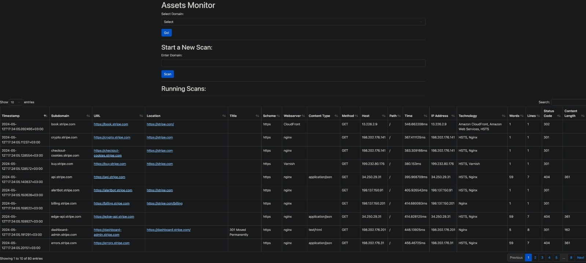

# Assets Monitor

Assets Monitor is a web interface application written in Python that allows you to monitor subdomains, directories, and various types of assets using HTTPX and MassDNS.
## Images (beta)

## Prerequisites

Before using Assets Monitor, ensure you have the following dependencies installed:

- [HTTPX](https://github.com/projectdiscovery/httpx)
- [MassDNS](https://github.com/blechschmidt/massdns)

## Installation

1. Clone the repository:

    ```bash
    git clone https://github.com/jonathan403/assets-monitor.git
    ```

2. Install Python dependencies:

    ```bash
    pip3 install -r requirements.txt
    ```

3. Install MassDNS (if not installed):

    Follow the installation instructions in the [MassDNS repository](https://github.com/blechschmidt/massdns) to compile and install MassDNS on your system.

4. Ensure MassDNS is in your PATH environment variable!

## Usage

1. Start the Assets Monitor web interface:

    ```bash
    python3 run.py
    ```

2. Access the web interface in your browser:

    Navigate to `http://127.0.0.1:5000` in your web browser to access the Assets Monitor.


## Features

- Monitor subdomains, directories, and various types of assets.
- Simple web interface for easy usage.
- Utilizes HTTPX and MassDNS for efficient asset monitoring.
- A lot more soon......

## Contributing

Contributions are welcome! If you have any ideas, suggestions, or bug fixes, feel free to open an issue or submit a pull request.

