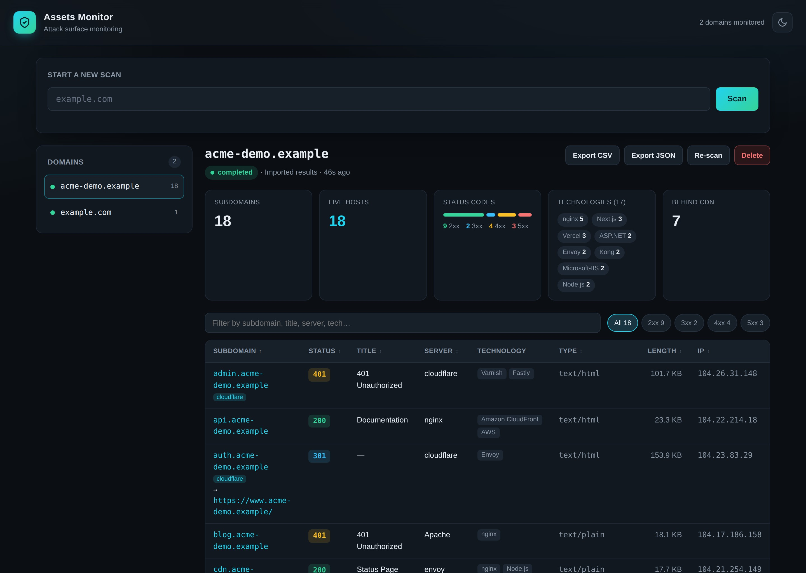

# Assets Monitor

Assets Monitor is a web application for **attack-surface monitoring**. Give it a
domain and it enumerates subdomains (via [MassDNS](https://github.com/blechschmidt/massdns))
and probes which of them are live over HTTP(S) (via
[httpx](https://github.com/projectdiscovery/httpx)), then presents everything in
a live dashboard: status codes, titles, detected technologies, servers, CDNs and IPs.

Use it only against assets you are authorized to test.



## Highlights

- **Live dashboard** — scans report progress in real time (queued → enumerating →
  probing → completed); no page reloads. Results land in a searchable, sortable,
  status-filterable table with summary stat cards.
- **JSON API** — every action is available over a small REST API, so scans can be
  driven and results consumed programmatically.
- **Safe by construction** — user input is strictly validated and external tools
  are invoked as argument lists (never through a shell), closing the command-
  injection and path-traversal holes present in earlier versions.
- **Durable state** — scan status and metadata are persisted per domain, so
  progress and history survive a restart. Re-scan a domain any time to monitor it
  over time.
- **No heavy front-end deps** — the UI is dependency-free vanilla JS/CSS with
  dark/light theming.

## How it works

```
            ┌─────────────┐   enumerate    ┌──────────────────┐
 domain ──▶ │ ScanManager │ ─────────────▶ │ SubdomainScanner │ ─▶ MassDNS
            │ (threaded,  │                 └──────────────────┘
            │  lock-safe) │   probe         ┌──────────────────┐
            │             │ ─────────────▶  │   HttpxScanner    │ ─▶ httpx
            └──────┬──────┘                 └──────────────────┘
                   │ persists
                   ▼
         results/<domain>/{subdomains.txt, httpx.json, meta.json}
                   ▲
                   │ reads
            ┌───────────────┐        ┌──────────────┐
   browser ─│  Flask API    │◀──────▶│    Store      │
            │  /api/scans…  │        └──────────────┘
            └───────────────┘
```

## Prerequisites

The web app and test suite run on Python alone. The scanning steps additionally
require these tools on your `PATH`:

- [httpx](https://github.com/projectdiscovery/httpx) — HTTP probing
- [MassDNS](https://github.com/blechschmidt/massdns) — subdomain enumeration

You can browse existing results and the API without them installed; only starting
a new scan needs the tools.

## Installation

```bash
git clone https://github.com/jonathann403/assets-monitor.git
cd assets-monitor
pip3 install -r requirements.txt
```

Install MassDNS following its
[repository instructions](https://github.com/blechschmidt/massdns) and ensure both
`massdns` and `httpx` are on your `PATH`.

## Usage

```bash
python3 run.py
```

Then open <http://127.0.0.1:5000>. Enter a domain to start a scan, and watch it
progress live. Click any scanned domain in the sidebar to inspect its assets.

For production, serve the app factory with a WSGI server instead of the dev
server:

```bash
gunicorn "app:create_app()"
```

## Configuration

All settings are environment variables with sensible defaults (see `config.py`):

| Variable | Default | Description |
| --- | --- | --- |
| `ASSETS_MONITOR_HOST` | `127.0.0.1` | Bind host |
| `ASSETS_MONITOR_PORT` | `5000` | Bind port |
| `ASSETS_MONITOR_DEBUG` | `false` | Flask debug mode (off by default) |
| `ASSETS_MONITOR_RESULTS_DIR` | `results` | Where scan output is stored |
| `ASSETS_MONITOR_WORDLIST` | bundled list | Subdomain wordlist |
| `ASSETS_MONITOR_HTTPX_BIN` | `httpx` | httpx binary |
| `ASSETS_MONITOR_MAX_SCANS` | `3` | Max concurrent scans |
| `SECRET_KEY` | dev value | Flask secret key |

## API

| Method | Path | Description |
| --- | --- | --- |
| `GET` | `/api/scans` | List all domains with status and counts |
| `POST` | `/api/scans` | Start a scan — body `{"domain": "example.com"}` |
| `GET` | `/api/scans/<domain>` | Results + summary for one domain |
| `GET` | `/api/scans/<domain>/status` | Live status of one scan (for polling) |
| `DELETE` | `/api/scans/<domain>` | Delete a domain's results |
| `GET` | `/api/scans/<domain>/export.csv` | Download results as CSV |

```bash
# start a scan
curl -X POST localhost:5000/api/scans -H 'Content-Type: application/json' \
     -d '{"domain": "example.com"}'

# poll its status
curl localhost:5000/api/scans/example.com/status
```

Responses use standard status codes: `400` invalid domain, `409` a scan is
already running, `429` concurrency limit reached, `404` unknown domain.

## Development

```bash
pip3 install -r requirements-dev.txt
pytest
```

The test suite covers input validation, the results store, the scan-lifecycle
manager and the API — with the external tools mocked, so it runs anywhere.

## Project layout

```
app/
  __init__.py       Flask application factory
  routes.py         HTML routes (dashboard shell)
  api.py            JSON API
  scan_manager.py   thread-safe scan lifecycle + persistence
  store.py          reads/writes results, computes summaries
  validators.py     domain normalization & validation
  static/           dashboard CSS + JS
  templates/        dashboard HTML
src/
  subdomains_scanner/  MassDNS wrapper
  httpx_scanner/       httpx wrapper
  massdns_scripts/     recon.py enumeration engine
config.py           environment-based configuration
tests/              pytest suite
```

## Contributing

Contributions are welcome — open an issue or a pull request.
